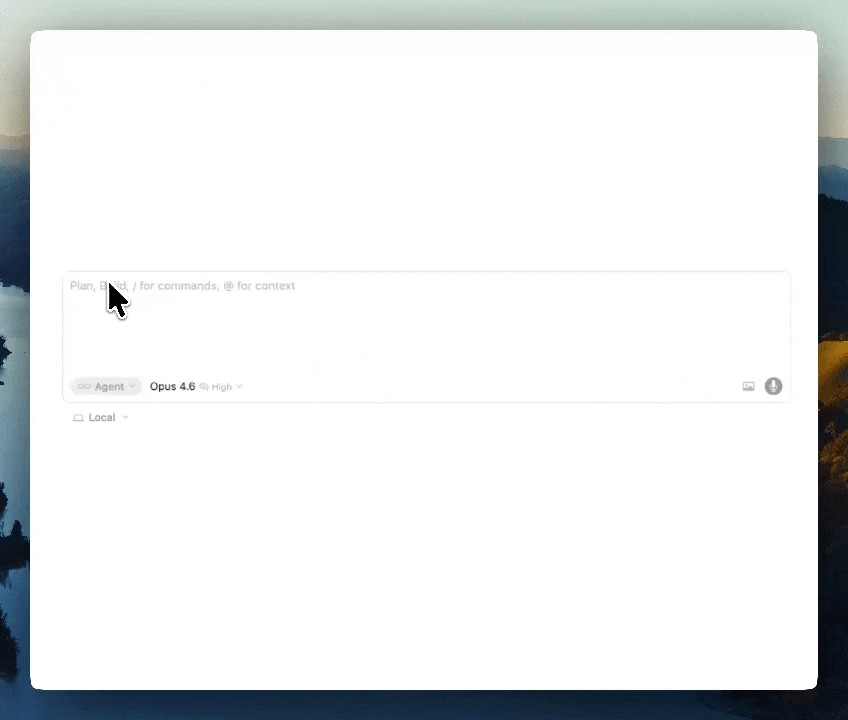

# outer-sunset

Never leave Cursor again. Your engineering task board, inside your editor. Real data from Linear and GitHub, rendered as an interactive MCP App.

outer-sunset connects to your Linear and GitHub accounts and gives you a live dashboard of everything you're working on — issues, PRs, review status, CI checks. Which means you no longer need to leave your editor. It also gives the AI agent tools to understand your workflow and act on it.



## What it does

**Visual board** — A live dashboard showing your Linear issues and GitHub PRs grouped by status. Auto-refreshes every 90 seconds. Changed cards get highlighted so you can see what moved.

**Needs attention** — Surfaces what matters: PRs waiting on review, failing CI, stale PRs with no approvals, issues stuck in progress with no PR.

**Conflict detection** — Cross-references file lists across your open PRs. If two PRs touch the same file, you see a warning before you try to merge.

**Lifecycle events** — Proactively tells you when a PR is approved and CI is green (ready to merge), without you asking.

**Agent tools** — The agent can answer follow-up questions using your board data:

| Say this | What happens |
|----------|-------------|
| "show my board" | Renders the visual dashboard |
| "write my standup" | Generates a standup update from real data |
| "what should I work on next?" | Ranks your Todo issues by priority and age |
| "start ENG-2501" | Assigns the issue to you in Linear, moves to In Progress, briefs the agent |
| "are any PRs stuck?" | Shows which PRs are waiting on review and for how long |
| "catch me up" | Restores your full working context in a new chat |
| "tell me about PR #4647" | Returns detailed PR info — description, files, CI checks, reviewers |
| "what's ENG-3642 about?" | Returns issue details — description, labels, comments |

## Context continuity

Every developer hits this: you close a chat, open a new one, and spend 2 minutes re-explaining what you were working on.

outer-sunset tracks your active task, recent actions, and board state in a persistent session. In a new chat, say **"catch me up"** or **"where did I leave off?"** and the agent has your full context instantly — what you're working on, which PR is open, who's reviewing it, and what's blocking you.

## Setup

### Prerequisites

- [Cursor](https://cursor.com) (or any MCP Apps-compatible host)
- Node.js >= 18
- A Linear API token
- A GitHub personal access token (with `repo` scope)

### Install

```bash
git clone https://github.com/jameslaneovermind/outer-sunset.git
cd outer-sunset
pnpm install
pnpm build
```

### Configure

Add to your Cursor MCP config (`.cursor/mcp.json` in your project, or global settings):

```json
{
  "mcpServers": {
    "outer-sunset": {
      "command": "node",
      "args": ["path/to/outer-sunset/dist/server/index.js", "--stdio"],
      "env": {
        "LINEAR_API_TOKEN": "lin_api_xxxxx",
        "GITHUB_TOKEN": "ghp_xxxxx",
        "LINEAR_TEAM_KEY": "ENG"
      }
    }
  }
}
```

For development, you can use `tsx` instead of the built output:

```json
{
  "mcpServers": {
    "outer-sunset": {
      "command": "npx",
      "args": ["tsx", "path/to/outer-sunset/src/index.ts", "--stdio"],
      "env": {
        "LINEAR_API_TOKEN": "lin_api_xxxxx",
        "GITHUB_TOKEN": "ghp_xxxxx",
        "LINEAR_TEAM_KEY": "ENG"
      }
    }
  }
}
```

Reload your Cursor window after saving the config.

### Environment variables

| Variable | Required | Description |
|----------|----------|-------------|
| `LINEAR_API_TOKEN` | Yes | Your Linear API key. Get one from Linear Settings > API. |
| `GITHUB_TOKEN` | Yes | GitHub personal access token with `repo` scope. |
| `LINEAR_TEAM_KEY` | No | Filter to a specific team (e.g. `ENG`). Defaults to all teams. |
| `GITHUB_OWNER` | No | Filter GitHub PRs to a specific org. |
| `ENABLE_ACTIONS` | No | Set to `true` to enable write actions (start task, request review). Off by default. |

### Write actions

By default, outer-sunset is read-only. To enable actions that mutate data (assigning issues in Linear, requesting reviews on GitHub), set `ENABLE_ACTIONS=true` in your env config.

## Session state

outer-sunset stores session state (active task, recent actions) at `~/.outer-sunset/session-state.json`. This is created automatically and stays outside your project directory.

## Development

```bash
pnpm run build:ui    # Build the React UI
pnpm run build:server # Build the server
pnpm run build       # Build both
pnpm run dev:ui      # Watch mode for UI changes
pnpm run start:dev   # Run server with tsx (no build needed)
pnpm test            # Run unit tests
```

## Architecture

outer-sunset is an [MCP App](https://modelcontextprotocol.io) — it combines an MCP server (tools + resources) with a React UI rendered in a sandboxed iframe.

```
src/
├── index.ts              # Entry point
├── server.ts             # MCP server — tool registration, data orchestration
├── data/
│   ├── board.ts          # Types and computation (attention, stats, lifecycle)
│   ├── linear.ts         # Linear GraphQL client
│   ├── github.ts         # GitHub REST client
│   ├── linker.ts         # Links Linear issues to GitHub PRs
│   ├── cache.ts          # In-memory cache (2-min TTL)
│   └── session.ts        # Persistent session state (~/.outer-sunset/)
└── ui/
    └── board/
        ├── index.html    # HTML shell
        └── mcp-app.tsx   # React board component
```

## License

Apache-2.0
